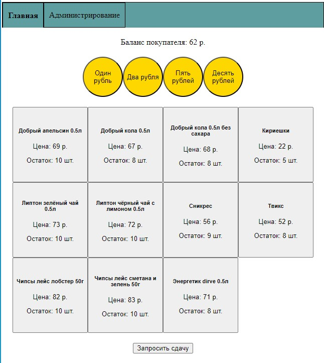
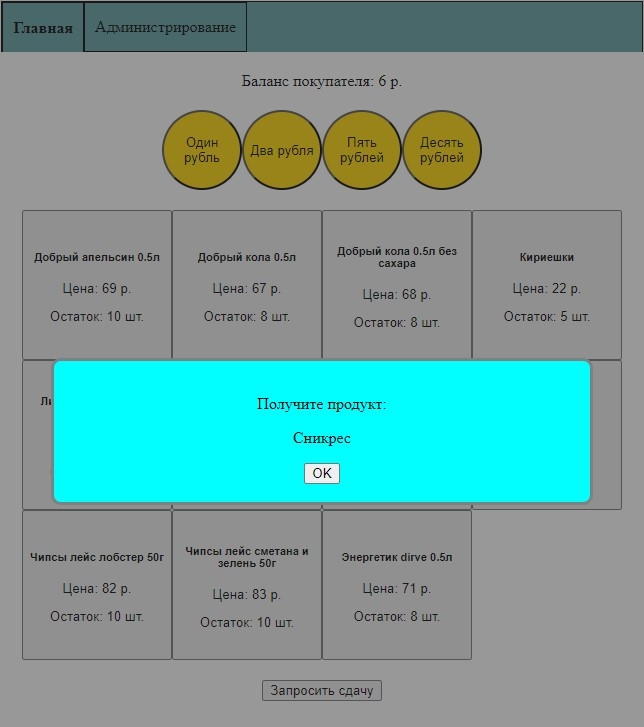
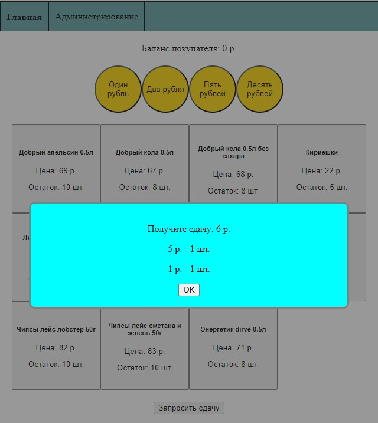
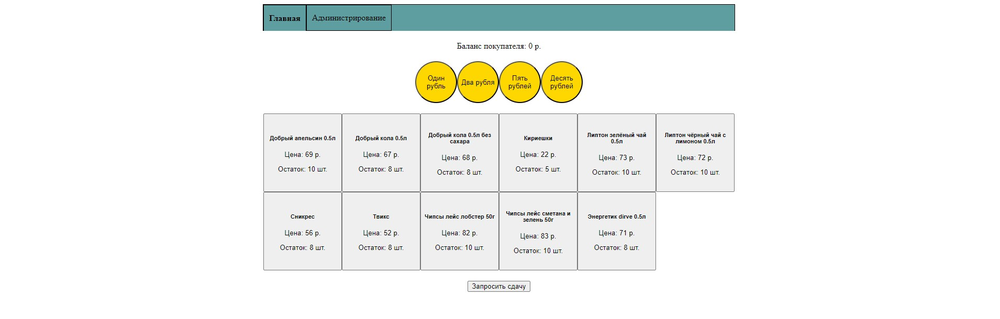
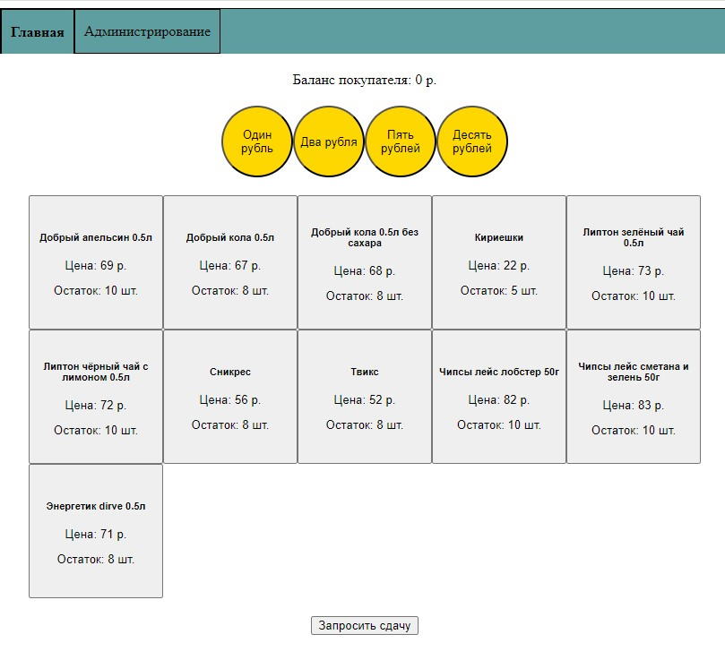
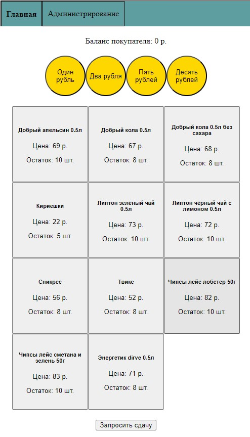

# Vending_machine

Приложение иммитирующее работу вендингового аппарата с напитками.

Приложение предназначено для демонстрации моих навыков перед потенциальным работодателем.

Демо приложение состоит технически из бэка на dotnet7 и фронта на angular, работает с БД на postgres.

По окончании MVP версии приложения планируется адаптация приложения под запуск в докере
одной командой docker-compose up или запуском говотого образа.

Приложение содержит 2 странички:
1. Страница пользователя
2. Страница администратора

На страничке пользователя покупатель может внести монеты кликая по соответствующим кнопкам, 
увидеть сумму внесённых им монет, выбрать товары для покупки и запросить сдачу. 
Автомат должен выдать товар и сдачу разными монетами исходя из того, какие есть в наличии.

На страничке администратора можно посмотреть баланс автомата,
остаток напитков, внести изменения, добавить типы продуктов или изменить их остаток.
А так же посмотреть список операций.

Демо приложение находится в процессе разработки в режиме "свободного художника",
поэтому функционал может дополняться или изменяться.

Тестовое задание
https://disk.yandex.ru/i/OLZe4NyxZSdEyw

## Инициализация БД
Для первоначальной инициализации БД необходимо запустить проект Vending_machine.Utilities.InitDatabase

## Настройка
### Vending_machine

appSettings.json:

`"DbSettings": {
"ConnectionString": "Host=localhost;Port=5432;User ID=postgres;Password=123;Database=vending_machine;"
}`

### Vending_machine.Utilities.InitDatabase

appSettings.json:

`    "ConnectionStrings": {
"PostgreSql": "Host=localhost;Port=5432;User ID=postgres;Password=123;Database=vending_machine;"
}`

# Скриншоты
### Интерфейс покупателя

### Покупка

### Сдача

### Адаптивный дизайн

Количество колонок подстраивается под ширину экрана

